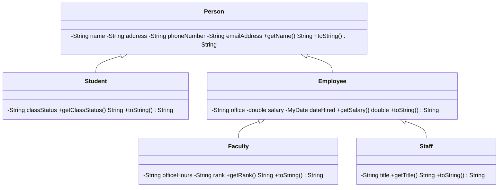

'# Soru 2 - Person Hiyerarşisi
Person; Student, Employee, Faculty ve Staff alt sınıflarını içerir.

```mermaid
classDiagram
  class Person { -String name -String address -String phoneNumber -String emailAddress +getName() String +toString() String }
  class Student { -String classStatus +getClassStatus() String +toString() String }
  class Employee { -String office -double salary -MyDate dateHired +getSalary() double +toString() String }
  class Faculty { -String officeHours -String rank +getRank() String +toString() String }
  class Staff { -String title +getTitle() String +toString() String }
  Person <|-- Student
  Person <|-- Employee
  Employee <|-- Faculty
  Employee <|-- Staff
```
`q2.Main` tüm nesnelerin toString çıktılarını yazdırır.'