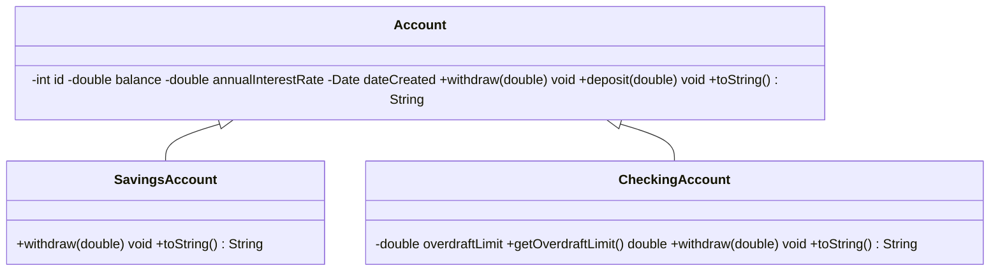

'# Soru 3 - Hesap Alt Sınıfları
Account sınıfından SavingsAccount ve overdraft limitli CheckingAccount türetilir.

```mermaid
classDiagram
  class Account { -int id -double balance -double annualInterestRate -Date dateCreated +withdraw(double) void +deposit(double) void +toString() String }
  class SavingsAccount { +withdraw(double) void +toString() String }
  class CheckingAccount { -double overdraftLimit +getOverdraftLimit() double +withdraw(double) void +toString() String }
  Account <|-- SavingsAccount
  Account <|-- CheckingAccount
```
`q3.Main` üç hesap türünü ve para çekme davranışlarını gösterir.'