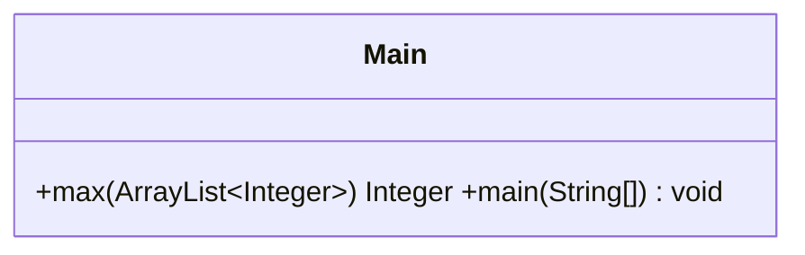

'# Soru 4 - ArrayList Maksimum
Dizi boş veya null ise null döndürür; aksi halde en büyük tam sayıyı bulur.

```mermaid
classDiagram
  class Main { +max(ArrayList~Integer~) Integer +main(String[]) void }
```
Kullanıcı 0 girene kadar sayıları girer ve maksimum değeri görüntüler.'