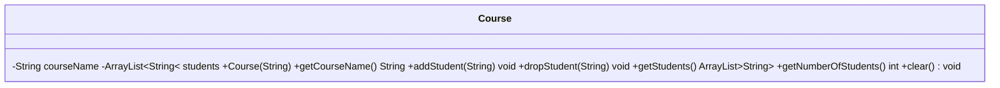

'# Soru 5 - ArrayList Kullanan Course
Öğrenci deposu artık ArrayList<String> ile tutulur.

```mermaid
classDiagram
  class Course { -String courseName -ArrayList~String~ students +Course(String) +getCourseName() String +addStudent(String) void +dropStudent(String) void +getStudents() ArrayList~String~ +getNumberOfStudents() int +clear() void }
```
`q5.Main` kurs oluşturur, öğrenci ekler/siler ve listeyi yazdırır.'