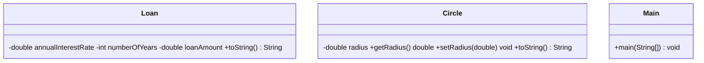

'# Soru 6 - Object ArrayList
Loan, Date, String ve Circle nesneleri Object listesine eklenir.

```mermaid
classDiagram
  class Loan { -double annualInterestRate -int numberOfYears -double loanAmount +toString() String }
  class Circle { -double radius +getRadius() double +setRadius(double) void +toString() String }
  class Main { +main(String[]) void }
```
`q6.Main` tüm öğelerin toString metodunu döngüyle çağırır.'