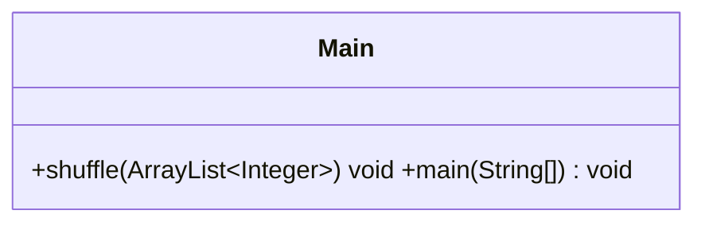

'# Soru 7 - ArrayList Karıştırma
Static shuffle yöntemi liste öğelerinin sırasını rastgele değiştirir.

```mermaid
classDiagram
  class Main { +shuffle(ArrayList~Integer~) void +main(String[]) void }
```
Program karıştırmadan önce/sonra listeyi gösterir.'