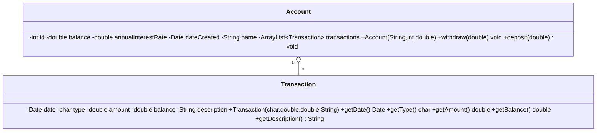

'# Soru 8 - Hesap İşlem Geçmişi
Deposit ve withdraw işlemleri Transaction nesnelerine kaydedilir.

```mermaid
classDiagram
  class Transaction { -Date date -char type -double amount -double balance -String description +Transaction(char,double,double,String) +getDate() Date +getType() char +getAmount() double +getBalance() double +getDescription() String }
  class Account { -int id -double balance -double annualInterestRate -Date dateCreated -String name -ArrayList~Transaction~ transactions +Account(String,int,double) +withdraw(double) void +deposit(double) void }
  Account "1" o-- "*" Transaction
```
`q8.Main` George hesabına yatırma/çekme işlemleri yapıp özet gösterir.'