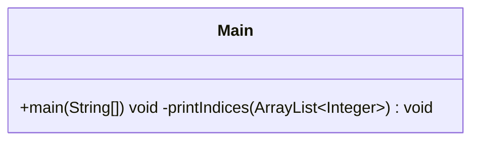

'# Soru 9 - Rastgele Matris
n x n matris oluşur; en çok 1 içeren satır ve sütunların tüm eşit indeksleri bulunur.

```mermaid
classDiagram
  class Main { +main(String[]) void -printIndices(ArrayList~Integer~) void }
```
Boyutu girin; matris ve en büyük satır/sütun indeksleri yazdırılır.'